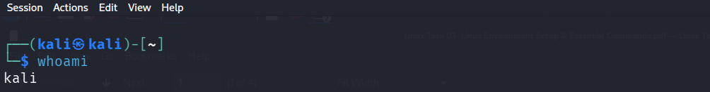
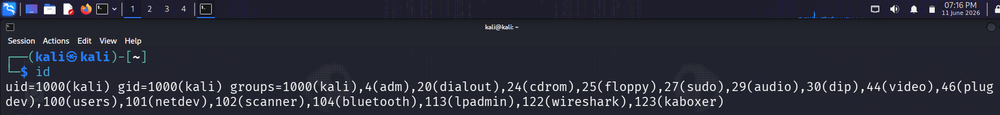
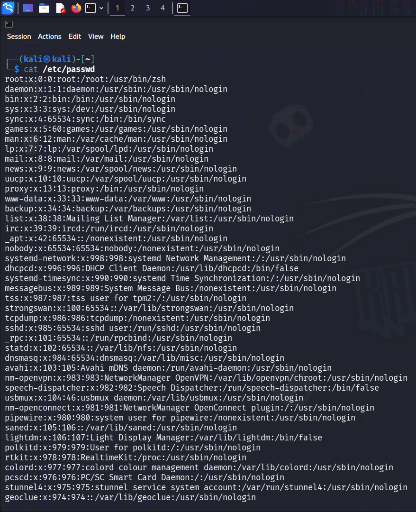
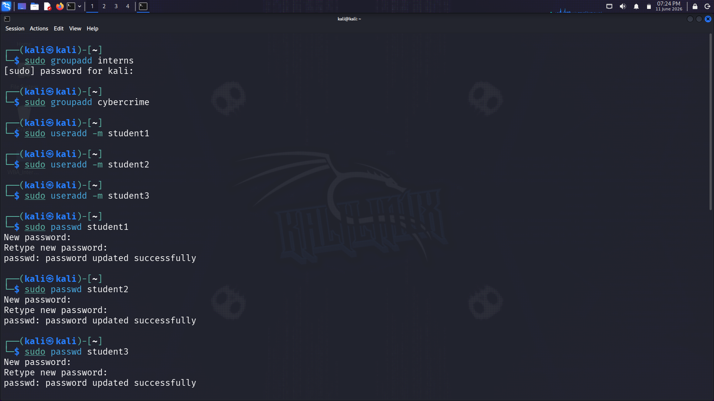
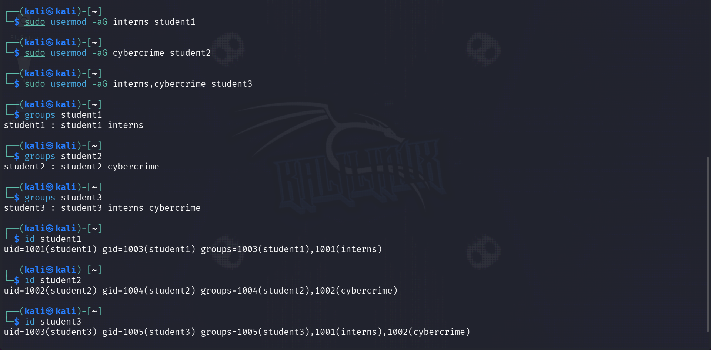
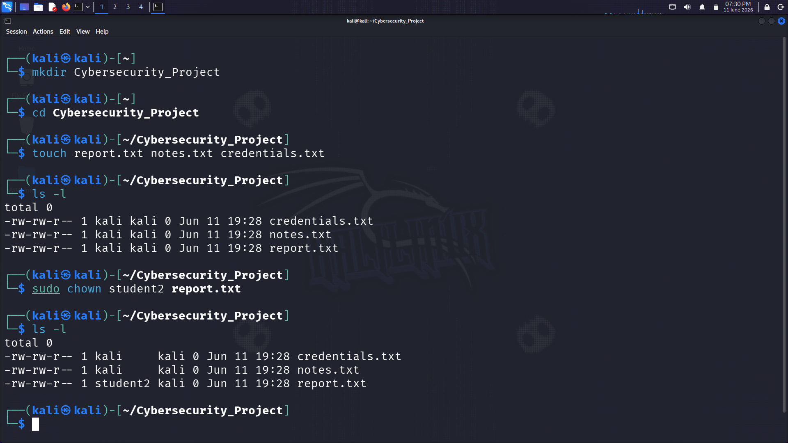
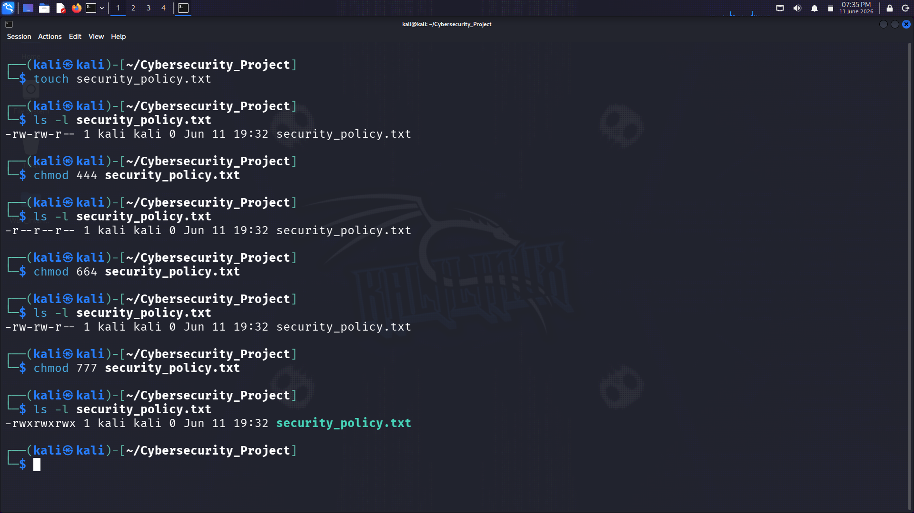

# Linux Task 02 - Users, Groups & File Permissions

## Student Information

**Name:** Bhakti Mahadev Parhad

**Internship:** White Band Associates Summer Internship - Cyber Security

**Task:** Linux Task 02 - Users, Groups & File Permissions

---

# Objective

The purpose of this task is to understand Linux user management, groups, file ownership, and file permissions.

These concepts form the foundation of Linux security and system administration.

---

# Part A - Understanding Users

## Commands Executed

```bash
whoami
id
cat /etc/passwd
```

## Tasks Completed

* Identified the current logged-in user.
* Observed User ID (UID).
* Observed Group ID (GID).
* Reviewed user account information stored in `/etc/passwd`.

## Screenshots

### whoami Output



### id Output



### cat /etc/passwd Output



---

# Part B - Create Users & Groups

## Groups Created

* interns
* cyberteam

## Users Created

* student1
* student2
* student3

## Tasks Completed

* Created Linux groups.
* Created Linux users.
* Added users to groups.
* Verified user and group membership.

## Screenshots

### Groups Creation and User Creation



### User and Group Verification



---

# Part C - File Ownership

## Project Directory

```text
CyberSecurity_Project
```

## Files Created

```text
report.txt
notes.txt
credentials.txt
```

## Tasks Completed

* Checked file ownership using `ls -l`.
* Changed ownership of a file using `chown`.
* Verified ownership changes.

## Screenshots

### File Ownership Before Change



---

# Part D - File Permissions

## File Created

```text
security_policy.txt
```

## Permission Changes Performed

| Permission Type | Permission |
| --------------- | ---------- |
| Read Only       | r--r--r--  |
| Read & Write    | rw-rw-r--  |
| Full Access     | rwxrwxrwx  |

## Commands Used

```bash
chmod 444 security_policy.txt
chmod 664 security_policy.txt
chmod 777 security_policy.txt
```

## Tasks Completed

* Checked current permissions using `ls -l`.
* Modified permissions using `chmod`.
* Verified permission changes.

## Screenshots

### Read Only Permission (444)



---

# Part E - Permission Analysis

The following permissions were analyzed:

* 755
* 644
* 777
* 600
* 700

For each permission the following were explained:

* Owner Rights
* Group Rights
* Other User Rights
* Real-world Use Cases

Detailed analysis is available in:

```text
Permission_Analysis.txt
```

---

# Part F - Security Challenge

Recommended permissions were assigned for:

| File Name           | Recommended Permission |
| ------------------- | ---------------------- |
| password_backup.txt | 600                    |
| public_notice.txt   | 644                    |
| system_log.txt      | 640                    |
| personal_notes.txt  | 600                    |

The permissions were selected based on security requirements and the Principle of Least Privilege (PoLP).

Detailed answers are available in:

```text
Security_Challenge.txt
```

---

# Part G - Linux Security Research

The following topics were researched:

* Why file permissions are important
* Risks of assigning 777 permissions to sensitive files
* Principle of Least Privilege (PoLP)
* Why organizations restrict user access

Detailed answers are available in:

```text
Research_Answers.txt
```

---


# Concepts Learned

During this task I learned:

* Linux Users and Groups
* User Management
* Group Management
* File Ownership
* File Permissions
* chmod Command
* chown Command
* Numeric Permissions
* Symbolic Permissions
* Principle of Least Privilege (PoLP)
* Linux Security Basics

---

# Conclusion

This task provided hands-on experience with Linux user management, group management, file ownership, and permissions.

Understanding these concepts is essential for securing Linux systems and forms a strong foundation for future cybersecurity and system administration tasks.
